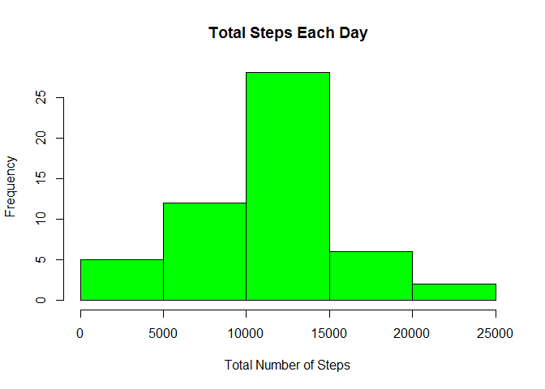
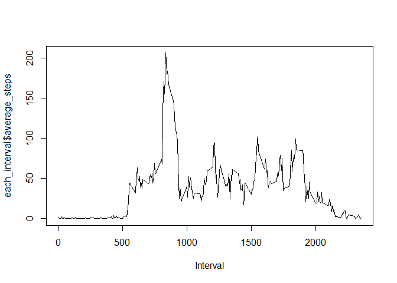
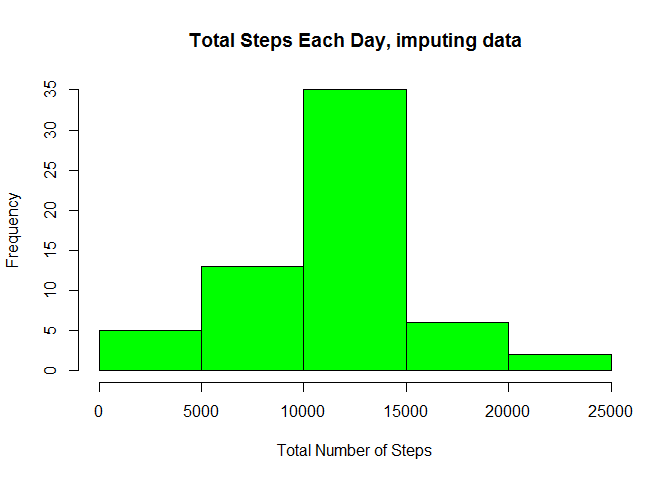
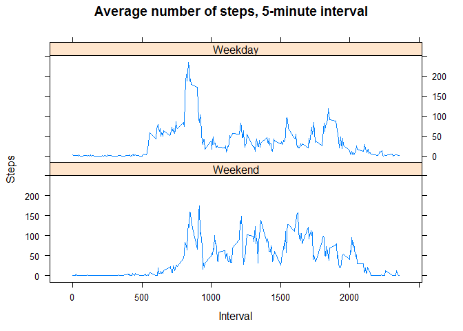

# Reproducible Research: Peer Assessment 1
## Set-up the needed libraries


```
## Warning: package 'dplyr' was built under R version 3.3.3
```

```
## 
## Attaching package: 'dplyr'
```

```
## The following objects are masked from 'package:stats':
## 
##     filter, lag
```

```
## The following objects are masked from 'package:base':
## 
##     intersect, setdiff, setequal, union
```

```
## Warning: package 'ggplot2' was built under R version 3.3.3
```

```
## Warning: package 'lubridate' was built under R version 3.3.3
```

```
## 
## Attaching package: 'lubridate'
```

```
## The following object is masked from 'package:base':
## 
##     date
```

```
## Warning: package 'lattice' was built under R version 3.3.3
```


## Loading and preprocessing the data

This part download from the internet the data, then load into R the desired dataset.


```r
setwd("D:/Data/Academic/Coursera/R/02.-Data Scients with R/05.-Reproducible Research/W2/09.-Course Project 1")
data<-read.csv("activity.csv")
```


## What is mean total number of steps taken per day?

The mean total number of steps taken per day is 10766.19, as we're going to see soon.

1. Calculate the total number of steps taken per day

```r
each_day<-data%>%
  filter(!is.na(steps))%>%
  group_by(date)%>%
  summarise(total_steps=sum(steps))
```

```
## Warning: package 'bindrcpp' was built under R version 3.3.3
```

2. Histogram of the total number of steps taken each day


```r
hist(each_day$total_steps, main = "Total Steps Each Day",col="Green", xlab="Total Number of Steps")
```

<!-- -->

3. Mean and median of the total number of steps taken per day


```r
each_day%>%
  summarise(Mean_steps=mean(total_steps),Median_steps=median(total_steps))
```

```
## # A tibble: 1 x 2
##   Mean_steps Median_steps
##        <dbl>        <int>
## 1   10766.19        10765
```


## What is the average daily activity pattern?


1. Time series plot of the 5-minute interval and the average number of steps taken, averaged across all days 


```r
each_interval<-data%>%
  filter(!is.na(steps))%>%
  group_by(interval)%>%
  summarise(average_steps=mean(steps))

plot(each_interval$interval,each_interval$average_steps,type="l", xlab="Interval")
```

<!-- -->

At the very beginning, we have a low average, then after the 500 interval there is an increasing trend with a pronounced spike.

2.Which 5-minute interval, on average across all the days in the dataset, contains the maximum number of steps?


```r
as.numeric(head(each_interval%>%arrange(desc(average_steps))%>%select(interval),1))
```

```
## [1] 835
```


## Imputing missing values

1. Calculate and report the total number of missing values in the dataset


```r
nrow(data%>%filter(is.na(steps)))
```

```
## [1] 2304
```

2. Strategy for filling in all of the missing values in the dataset:

The strategy consists in generating the random observations base on the actual observation

Since we have a lot of zero steps within intervals the idea is to know the rate of non-zero steps

```r
rate<-nrow(data%>%filter(!is.na(steps),steps>0))/nrow(data%>%filter(!is.na(steps)))
```

Then, taken into account only the non-zero steps we are going to generate a random Poisson vector containing pseudo steps

```r
Avg_step<-as.numeric(data%>%filter(!is.na(steps),steps>0)%>%summarise(mean_steps=mean(steps)))
steps_random<-rpois(nrow(data),Avg_step)
```

Base on the non-zero steps rate we are going to choose about 27% of the randomly generated steps, keeping the rest (73%) as zero

```r
dummy_steps<-rbinom(n=nrow(data),size=1, prob=rate)
imputing_steps<-steps_random*dummy_steps
```

3. Create a new dataset that is equal to the original dataset but with the missing data filled in.


```r
data<-cbind(data,imputing_steps)
data<-data%>%mutate(imputing_steps=ifelse(is.na(steps),imputing_steps,steps))
```

4. Make a histogram of the total number of steps taken each day and Calculate and report the mean and median total number of steps taken per day. Do these values differ from the estimates from the first part of the assignment? What is the impact of imputing missing data on the estimates of the total daily number of steps?


```r
each_day_after<-data%>%
  group_by(date)%>%
  summarise(total_steps=sum(imputing_steps))


hist(each_day_after$total_steps, main = "Total Steps Each Day, imputing data",col="Green", xlab="Total Number of Steps")
```

<!-- -->


```r
each_day_after%>%
  summarise(Mean_steps=mean(total_steps),Median_steps=median(total_steps))
```

```
## # A tibble: 1 x 2
##   Mean_steps Median_steps
##        <dbl>        <int>
## 1   10796.51        10814
```

As we can see, the mean and the median are pretty close to the originals the main difference here is the heights of the bars within the histogram, because now we have more observations.

## Are there differences in activity patterns between weekdays and weekends?

1. Create a new factor variable in the dataset with two levels - "weekday" and "weekend" indicating whether a given date is a weekday or weekend day.


```r
data$date<-ymd(data$date)
day<-wday(data$date, label = TRUE)
data<-cbind(data,day)
data$type_day<-data$day
levels(data$day)
```

```
## [1] "Sun"   "Mon"   "Tues"  "Wed"   "Thurs" "Fri"   "Sat"
```

```r
levels(data$type_day)<-c("Weekend","Weekday","Weekday","Weekday","Weekday","Weekday","Weekend")
levels(data$type_day)
```

```
## [1] "Weekend" "Weekday"
```

2. Make a panel plot containing a time series plot (i.e. type = "l") of the 5-minute interval (x-axis) and the average number of steps taken, averaged across all weekday days or weekend days (y-axis). See the README file in the GitHub repository to see an example of what this plot should look like using simulated data.


```r
t_day<-data%>%
  filter(!is.na(steps))%>%
  group_by(interval,type_day)%>%
  summarise(total_steps=mean(steps))


xyplot(t_day$total_steps ~ t_day$interval|t_day$type_day,
  main="Average number of steps, 5-minute interval",xlab="Interval", ylab="Steps",layout=c(1,2), type="l")
```

<!-- -->

Yes, weekends have more stable pattern, than weekdays, as we can see from the above graphs 
